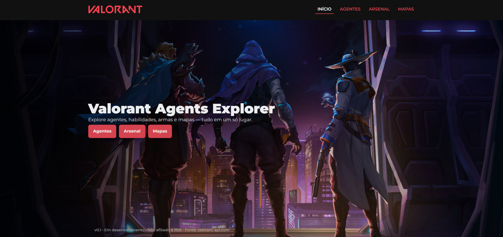

# Valorant Agents Explorer

Projeto em desenvolvimento. Aplicação web para **explorar agentes, armas e mapas do Valorant**.  
A ideia é evoluir o app continuamente, mantendo-o utilizável a cada etapa.

- **Site (em andamento):** https://pedrojuanofc.github.io/valorant-agents-explorer/

## Páginas Web
### Home

### Agents

### Arsenal

### Maps

## Páginas Mobile

  
  
  
  

## Visão geral
- **Layout-first**: primeiro a interface (HTML/CSS/JS), depois a integração de dados.
- **Dados públicos** via [Valorant-API](https://valorant-api.com/).
- Próximos incrementos: filtros por função/arma/mapa, páginas detalhadas, animações e i18n (pt/en).

## Status atual
- Estrutura inicial do projeto e navegação.
- **Listagens funcionais** consumindo API: agentes, armas e mapas.

## Stack
- **Front-end:** HTML, CSS, JavaScript (migração futura para React).
- **API:** Valorant-API (não oficial).

## Endpoints de referência (API)
- Agentes jogáveis: `GET https://valorant-api.com/v1/agents?isPlayableCharacter=true`
- Detalhe do agente: `GET https://valorant-api.com/v1/agents/{uuid}`
- Armas: `GET https://valorant-api.com/v1/weapons`
- Mapas: `GET https://valorant-api.com/v1/maps`

## Próximos passos
- [ ] Página de detalhes do agente (habilidades e descrições).
- [ ] Filtros e busca (role/alfabético/arma/mapa).
- [ ] Animações e estados de carregamento.
- [ ] Internacionalização (pt/en).

## Autor
**Pedro Juan** — [LinkedIn](https://www.linkedin.com/in/pedro-juan-ferreira-saraiva/) • [GitHub](https://github.com/PedroJuanOfc)
